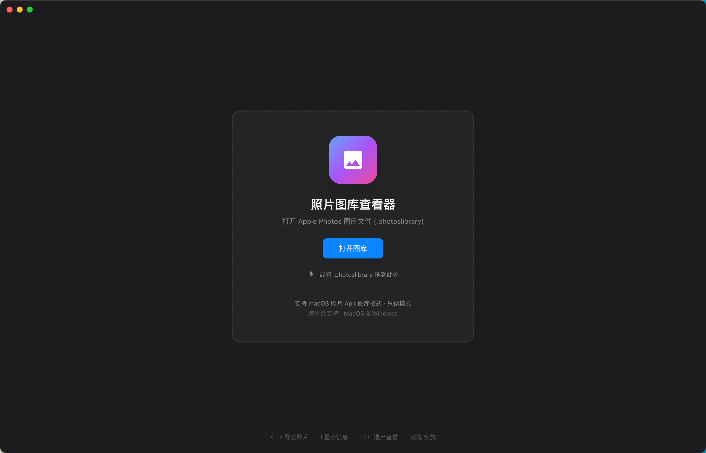
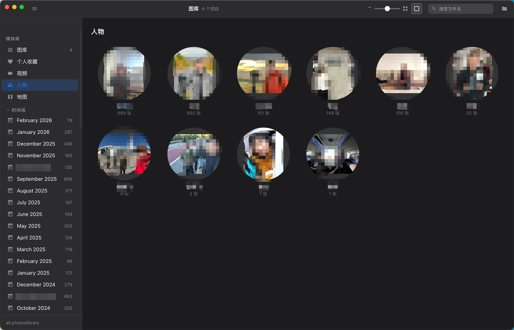
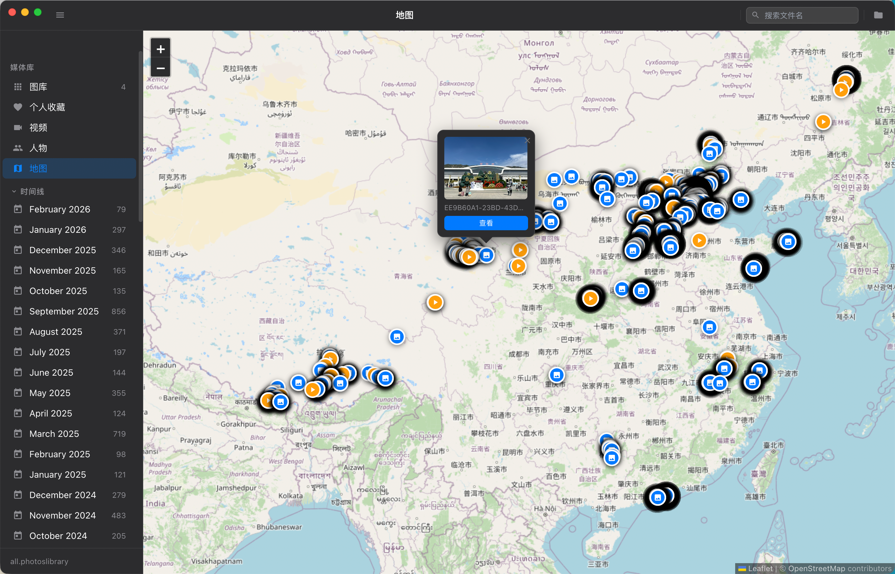

# Photos Library Viewer

跨平台的 Apple Photos 图库查看器，支持 macOS 和 Windows。界面风格高度还原 macOS 照片 App，支持打开 `.photoslibrary` 格式的图库文件，**只读，不修改任何数据**。

---

## 截图

<table>
  <tr>
    <td></td>
    <td></td>
  </tr>
  <tr>
    <td align="center">欢迎界面</td>
    <td align="center">照片网格 · 时间线视图</td>
  </tr>
  <tr>
    <td></td>
    <td></td>
  </tr>
  <tr>
    <td align="center">人物视图</td>
    <td align="center">地图视图 · GPS 标记</td>
  </tr>
</table>

---

## 功能特性

### 浏览
- 📁 打开 `.photoslibrary` 图库（拖拽或点击选择，支持命令行直接传入路径）
- 🖼️ 照片网格视图，按月份分组，支持缩略图懒加载 + 无限滚动
- 🔍 关键词搜索（文件名 / 目录）
- 🎚️ 网格大小滑块（5 个档位）
- ⬜ 方形 / 原比例切换模式

### 查看器
- 🎞️ 全屏查看器，底部胶片条导航
- ⌨️ 键盘快捷键：`← →` 切换 / `I` 信息面板 / `ESC` 关闭 / `+` `-` 缩放 / `0` 还原
- 🖱️ 滚轮缩放 + 拖拽平移，双击切换 2× / 适合窗口
- 📷 照片信息面板：相机型号、镜头、焦距、光圈、快门、ISO、GPS 坐标
- 🖼️ HEIC / HEIF 原图原生渲染（macOS，Electron 内置系统解码器）
- 🎬 Live Photo 支持：长按 `LIVE` 标记播放动态照片（iOS 风格）
- 📹 视频播放（MOV / MP4 / HEVC，支持 moov-at-end 大文件流式播放）
- ❤️ 收藏 / 取消收藏（写回 `.photoslibrary` 元数据）

### 侧栏
- ❤️ 个人收藏 / 📹 视频 / 👤 人物 / 🗺️ 地图
- 📅 时间线（按年 / 月统计，可点击跳转）
- 📁 我的相簿（列出图库内所有相簿）

### 人物
- 👥 识别已命名人物，展示人物头像（关键人脸照片缩略图）
- 点击人物进入该人物的照片列表

### 地图
- 🗺️ 将带 GPS 坐标的照片标记在 OpenStreetMap 上
- 点击标记可预览照片并进入查看器
- 地图数据在同一图库中缓存，切换视图无需重新加载

---

## 环境要求

| 项目 | 版本 |
|------|------|
| Node.js | ≥ 18 |
| npm | ≥ 9 |
| Electron | 29（已包含在 devDependencies） |

> **Windows 打包**需要在 macOS/Linux 上交叉编译，或使用 Windows 机器本地运行。
> **macOS 打包**需要在 macOS 上执行（签名/公证需 Apple 开发者账号，不签名可跳过）。

---

## 快速开始

### 1. 安装依赖

```bash
cd PhotosLibraryViewer
npm install
```

### 2. 构建 UI

```bash
npx vite build
```

### 3. 运行

```bash
# 直接启动（在界面内选择图库）
npm start

# 启动并自动加载指定图库
npx electron . "/path/to/your.photoslibrary"

# 启动并自动加载同目录下的 default.photoslibrary
npm run start:sample
```

---

## 开发模式（热更新）

开发模式同时启动 Vite 开发服务器和 Electron，修改 React 代码后自动刷新：

```bash
npm run dev
```

> 注意：`main.js` 和 `preload.js` 修改后需手动重启 Electron。

---

## 打包发布

### macOS（生成 .dmg）

```bash
# 方式一：使用 npm script（先构建 UI 再打包）
npm run build:mac

# 方式二：分步执行
npx vite build
npx electron-builder --mac --x64          # Intel Mac
npx electron-builder --mac --arm64        # Apple Silicon (M1/M2/M3)
npx electron-builder --mac --universal    # 通用包（同时支持 Intel + Apple Silicon）
```

### Windows（生成 .exe 安装包）

```bash
# 方式一：使用 npm script（先构建 UI 再打包）
npm run build:win

# 方式二：分步执行
npx vite build
npx electron-builder --win --x64          # 64 位 Windows
npx electron-builder --win --ia32         # 32 位 Windows（较旧机器）
```

> 在 macOS 上交叉编译 Windows 安装包时，需要安装 Wine：
> ```bash
> brew install --cask wine-stable
> ```

### 同时打包 macOS + Windows

```bash
npx vite build && npx electron-builder --mac --win
```

打包产物输出到 `release/` 目录。

---

## 使用说明

### 打开图库

启动后显示欢迎界面，有三种方式打开图库：

1. **点击「打开图库」按钮** → 系统文件选择器
2. **拖拽图库到欢迎界面** → 将 `.photoslibrary` 文件夹拖到窗口
3. **命令行直接传入路径**：
   ```bash
   npx electron . "/Users/yourname/Pictures/照片图库.photoslibrary"
   ```

### 查看照片

| 操作 | 说明 |
|------|------|
| 单击照片 | 进入全屏查看器 |
| `← →` 方向键 | 切换上一张 / 下一张 |
| 滚轮 | 缩放照片 |
| 双击 | 切换 2× / 适合窗口 |
| 拖拽（放大后）| 平移照片 |
| `I` | 显示 / 隐藏照片信息面板 |
| `+` / `-` | 放大 / 缩小 |
| `0` | 恢复适合窗口 |
| `ESC` | 关闭查看器 |

### Live Photo

在全屏查看器中，若照片为 Live Photo，左上角显示 `◎ LIVE` 标记：

- **长按** `LIVE` 标记 → 播放动态视频片段（松手停止）

### 侧栏导航

| 分类 | 说明 |
|------|------|
| 图库 | 全部照片，按拍摄时间倒序 |
| 个人收藏 | 已收藏的照片 |
| 视频 | 仅显示视频文件 |
| 人物 | 已命名人物的人脸合集 |
| 地图 | 带 GPS 坐标的照片在地图上的分布 |
| 我的相簿 | 用户创建的相簿 |
| 时间线 | 按年 / 月统计，点击筛选 |

### 搜索

工具栏搜索框支持按**文件名**和**目录路径**实时过滤。

---

## 项目结构

```
PhotosLibraryViewer/
├── main.js              # Electron 主进程（数据库读取、IPC、协议注册、视频流）
├── preload.js           # 预加载脚本（向渲染进程暴露安全 API）
├── index.html           # HTML 入口
├── vite.config.js       # Vite 构建配置
├── tailwind.config.js   # Tailwind CSS 配置
├── package.json         # 依赖 + electron-builder 打包配置
├── src/
│   ├── main.jsx             # React 入口
│   ├── App.jsx              # 根组件（视图路由 / 全局状态）
│   ├── styles/
│   │   └── index.css        # 全局样式 + 动画
│   └── components/
│       ├── WelcomeScreen.jsx    # 欢迎 / 打开图库界面
│       ├── Toolbar.jsx          # 顶部工具栏（搜索、网格、方形模式）
│       ├── Sidebar.jsx          # 侧栏导航（相簿、时间线、人物、地图）
│       ├── PhotoGrid.jsx        # 照片网格（按月分组 + 无限滚动）
│       ├── PhotoCard.jsx        # 单张缩略图卡片（懒加载）
│       ├── PhotoViewer.jsx      # 全屏查看器（缩放/平移/Live/视频/信息面板）
│       ├── MapView.jsx          # 地图视图（Leaflet + GPS 标记，带缓存）
│       └── PeopleView.jsx       # 人物视图（人脸头像网格 + 人物照片列表）
└── dist/                # Vite 构建产物（运行/打包前需先执行 vite build）
```

---

## 技术栈

| 技术 | 用途 |
|------|------|
| [Electron 29](https://www.electronjs.org/) | 跨平台桌面框架，内置 Chromium 122（支持 HEIC 原生渲染） |
| [React 18](https://react.dev/) | UI 框架 |
| [Vite 5](https://vitejs.dev/) | 构建工具 |
| [Tailwind CSS 3](https://tailwindcss.com/) | 样式 |
| [sql.js](https://sql.js.org/) | WASM 版 SQLite（读取 Photos.sqlite） |
| [Leaflet](https://leafletjs.com/) | 地图渲染 |
| [electron-builder](https://www.electron.build/) | 打包 / 分发 |

---

## 注意事项

- **只读**：本工具以只读模式访问图库，收藏功能通过写入独立 JSON 文件实现，不修改 Photos.sqlite。
- **HEIC 显示**：需要 macOS + Electron 29+（Chromium 122 内置系统 HEIC 解码器）。Windows 上 HEIC 原图不可用，自动降级为 JPEG 缩略图。
- **HEVC 视频**：已启用 `PlatformHEVCDecoderSupport`，支持 H.265 编码的 iPhone 视频（包含 moov-at-end 大文件）。
- **跨平台打开图库**：在 Windows 上打开 macOS 生成的图库时，缩略图路径跨平台可用，但原图为 macOS 绝对路径，建议将整个 `.photoslibrary` 文件夹复制到目标机器。
- **数据库内存占用**：sql.js 会将整个数据库读入内存，大型图库（>500MB 数据库）初次打开需要数秒。
